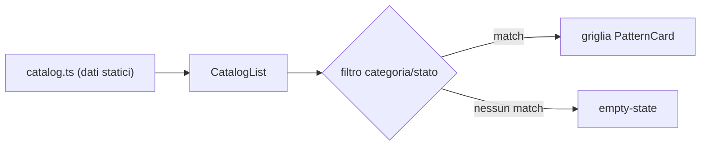

# patterns — Catalogo pattern FE

Landing hello-world + **catalogo dei pattern architetturali FE** del
workspace, esposto come dati (ADR 0009): 24 voci, 8 categorie, censite su
universal-canvas (template) e `apps/dashboard` (adozione reale in xp-flow).
React 19 + Tailwind v4, Vite SPA minimale, porta dev 8090.

## Catalogo

Il catalogo (`src/catalog/catalog.ts`) è **solo dati**: ogni voce punta al
sorgente reale (`source.repo` + `source.path`), zero copia di codice
cross-repo. Ripartizione per categoria: 6 architecture, 5 ui, 4 data,
3 state, 2 platform, 2 testing, 1 errors, 1 i18n. Per stato: 23
`used-in-dashboard`, 1 `available-in-template`, 0 `to-extract`. L'estrazione
reale di un pattern in `packages/` resta un evento separato, a trigger
(ADR 0006) — non avviene da qui.

## Avvio rapido

Prerequisiti (dalla radice del monorepo): `nvm use` (Node 22 da `.nvmrc`)
e `pnpm install` — da rifare dopo ogni pull che tocca i `package.json`.

```bash
pnpm --filter patterns dev         # dev server, http://localhost:8090
pnpm --filter patterns build       # build di produzione (Vite)
pnpm --filter patterns test        # unit vitest (dominio catalogo + UI)
pnpm --filter patterns lint        # eslint --max-warnings 0
pnpm --filter patterns typecheck   # tsc --noEmit
```

## Struttura di `src/`

- `catalog/catalog.ts` — dominio dati puro: tipi (`Category`, `SourceRepo`,
  `PatternStatus`, `PatternView`) e l'array `catalog`. Zero dipendenze da
  React o altra infrastruttura.
- `i18n/messages.ts` — testi tipizzati, locale default `it`, `en` sempre
  disponibile; le label di categoria/stato sono `Record` completi sulle
  union chiuse del catalogo (nessuna label mancante può compilare).
- `components/CatalogList.tsx` — lista + filtri client-side (categoria,
  stato), sotto-componente privato `PatternCard`, file singolo.
- `components/HelloWorld.tsx` — intestazione della landing, solo testo da i18n.
- `App.tsx` / `main.tsx` — wiring (composizione + mount), nessuna logica.

Dipendenze sempre verso l'interno: il dominio dati (`catalog/`) non conosce
React né i componenti; i componenti dipendono dal tipo `PatternView`, mai il
contrario.

## Flusso



## Aggiungere o aggiornare una voce del catalogo

1. Aggiungi l'oggetto a `catalog` in `src/catalog/catalog.ts`: `id`
   kebab-case univoco, `name`, `description.it`/`description.en` non vuote,
   `category` (una di `CATEGORIES`), `source.repo` + `source.path` (deve
   esistere davvero — presidiato dai test per `repo: "xp-flow"`), `status`.
2. Se introduci una `category` o uno `status` nuovi: aggiungi la label
   corrispondente in `src/i18n/messages.ts` per `it` **e** `en` — sono
   `Record` completi sulle union chiuse, quindi una label mancante non
   compila, non finisce a runtime come slug grezzo.
3. Aggiorna il conteggio voci atteso in `tests/unit/catalog.spec.ts`
   (asserito esplicitamente) e verifica che `tests/unit/catalog-ui.spec.tsx`
   resti verde.

## Fuori scope (slice 1)

Nessuna estrazione reale in `packages/`, nessun selettore di lingua/provider
i18n, nessun controllo di drift automatico contro universal-canvas (il
catalogo può invecchiare — rischio accettato in ADR 0009). Hardening dei
test resta una voce aperta in `TODO.md`; le slice successive (estrazione
pattern, drift check) sono normate da ADR 0009.
