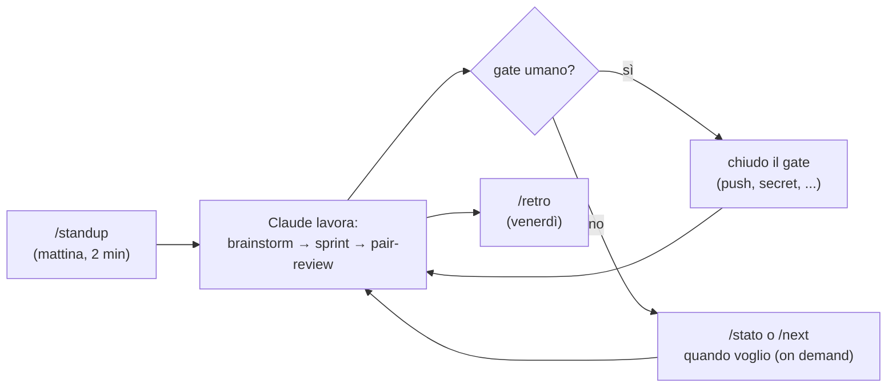

# Mappa dei comandi — quale uso e quando

> Cheat-sheet funzionale. Due famiglie: **cerimonie/utility** (scope utente,
> `~/.claude/commands/`, valgono in ogni chat) e **flusso XP** (scope repo,
> `.claude/commands/` di xp-flow, valgono nelle sessioni aperte da qui).

## "Voglio essere aggiornato" — cerimonie e utility (li lancio io, utente)

| Domanda che ho in testa | Comando | Cosa ottengo |
|---|---|---|
| Standup del mattino: che si fa oggi? | `/standup` | fatto ieri · oggi · blocchi · **serve da te** (solo gate) |
| A che punto siamo? (al volo) | `/stato` | TL;DR ≤15 righe: focus, repo, pendenze, prossimo passo |
| Aggiornamento completo con roadmap | `/stato deep` | + Gantt/diagrammi, scoperte, decisioni, deprecati, rischi, north-star |
| Cosa succede adesso, in concreto? | `/next` | UN passo: cosa fa Claude, e l'eventuale gate che tocca a me |
| Fine giornata: chiudo e riordino | `/consolida` | fonde i md del giorno in un unico canonico `agile/YYYY-MM-DD.md`, pota il deprecato col perché, history di sviluppo — leggibile anche dagli agenti |

Ogni output viene anche salvato nel diario `agile/YYYY-MM-DD-<comando>.md` di questo repo.

## "Si lavora" — flusso XP (li orchestra Claude, dentro una sessione xp-flow)

| Fase | Comando | Chi lavora |
|---|---|---|
| Idea → specifica Gherkin + E2E rossi + stime SP | `/brainstorm <idea o #issue>` | problem-explorer, test-writer |
| Sviluppo TDD top-down, timebox 2 giorni | `/sprint` | implementatore (+ escalation da policy) |
| Review adversarial, obbligatoria per chiudere uno scenario | `/pair-review` | adversarial-reviewer vs implementatore |
| Retrospettiva di fine settimana — UNICO momento in cui il metodo si può cambiare | `/retro` | retro-analyst + analisi nel main |

## Gate umani (l'unica cosa che eseguo io)

`git push` verso `main` (gli agenti possono SOLO `git push origin feat/*`, ADR
0007 — main si entra via PR con required checks) · secret/token · pagamenti ·
verifiche in-app · scritture su DB.
Vengono sempre elencati in "serve da te" (standup/stato) e tracciati come eventi
`azione_manuale` nell'event log finché non li chiudo.

## Giornata tipo

## Gli agenti: chi lavora quando

| Agente | Modello | Lo invoca | Cosa fa |
|---|---|---|---|
| problem-explorer | haiku | `/brainstorm` (o a mano) | esplora codice/docs/issue in sola lettura, torna sintesi ≤15 righe |
| test-writer | sonnet | `/brainstorm`, inizio scenario | Gherkin + E2E rossi + stima SP |
| solution-architect | opus | decisioni costose da invertire | ADR breve in docs/adr/ + sintesi (è il "TL" del team) |
| implementatore | sonnet | `/sprint` | TDD top-down; include il lavoro UI (mockup = spec) |
| adversarial-reviewer | opus | `/pair-review` | caccia difetti/flaky; obiezioni numerate con severità |
| documentarista | sonnet | fine scenario/sprint | allinea i docs non generabili al codice |
| retro-analyst | haiku | `/retro` | dati (git, issue, eventi), niente opinioni |

Regole d'uso:
- **PO = l'umano**, non un agente: standup, gate e priorità restano fuori dal roster.
- Attivi **2-3 per volta** (oltre 5 = sovra-frammentazione, si ri-accorpa).
- Invocazione manuale: in sessione basta chiederlo in linguaggio naturale
  ("usa il subagente problem-explorer per capire X") — il main orchestra.
- Ritornano SOLO sintesi distillate; lo stato condiviso vive su file, mai in chat.
- Escalation di modello: automatiche secondo docs/model-selection.md, loggate nell'event log.

## Dove vivono (per modificarli o aggiungerne)

- Cerimonie/utility: `~/.claude/commands/{standup,stato,next}.md` — modificabili liberamente, NON coperti dal freeze.
- Flusso XP: `.claude/commands/{brainstorm,sprint,pair-review,retro}.md` in questo repo — **congelati fino alla 2ª retro** (modifiche solo da `/retro`).
- Candidati non ancora creati (si aggiungono solo se serve, YAGNI): `/pendenze` (solo gate aperti), `/riprendi` (ripartenza a inizio sessione).
