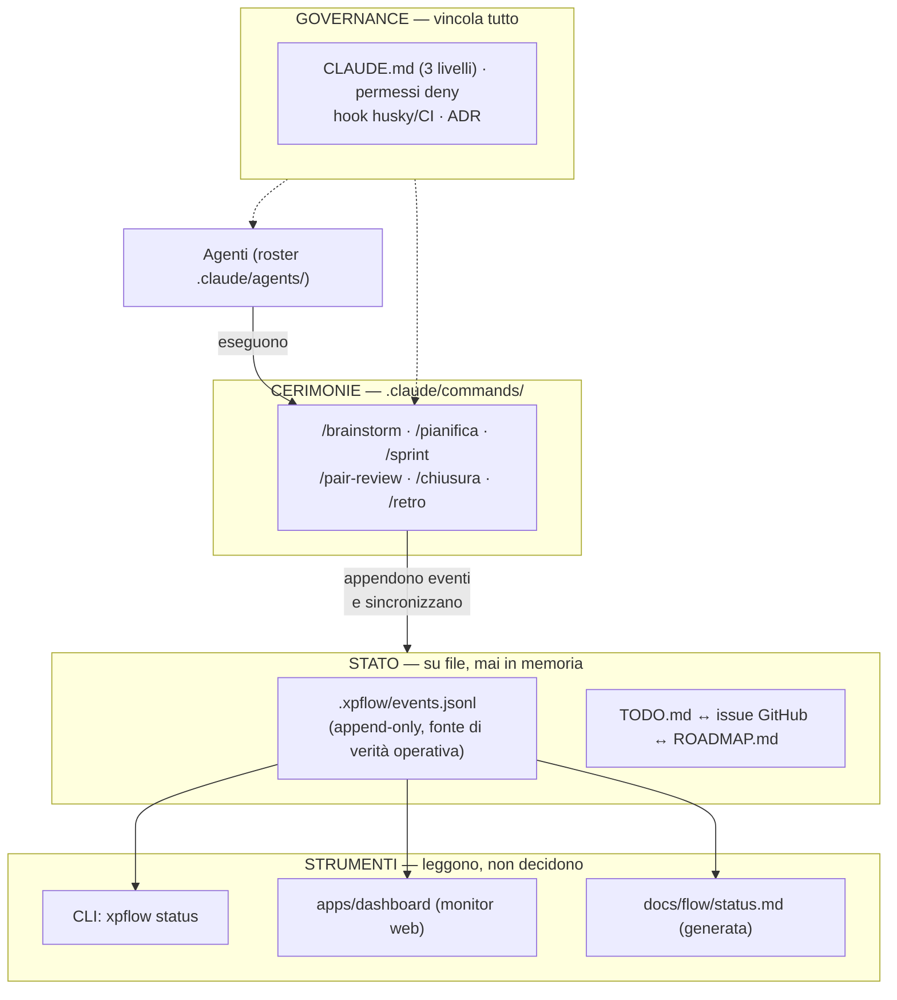
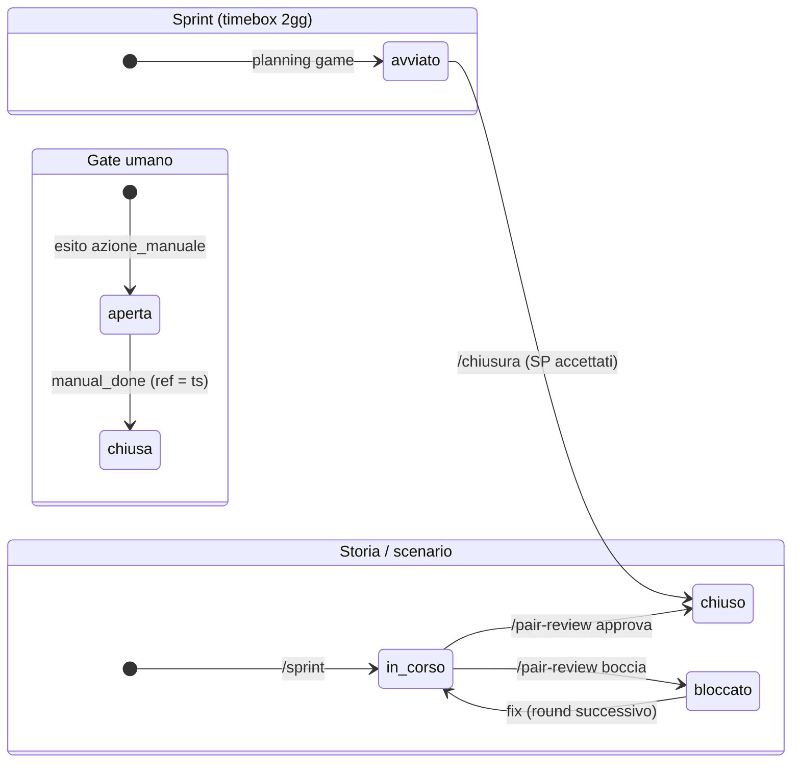
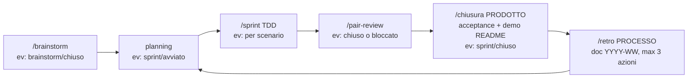

# XP Flow — come funziona (vista di sistema)

> La domanda a cui risponde: "com'è fatta l'app che gestisce lo sviluppo
> XP — blocchi, dati, stati, flussi — e dove guardo quando mi sento
> perso?". È una vista descrittiva: le fonti restano il
> [README](../README.md) (mappa dei file), la
> [guida file e priorità](guida-file-e-priorita.md) (cosa carica una
> sessione e chi vince), il [metodo](metodo-sviluppo-agentico.md) (i
> perché) e il CLAUDE.md del repo (le regole). Se questo doc li
> contraddice, vincono loro.

## 1. I quattro blocchi

## 2. Struttura dati

Un solo record: l'**evento** — `{ts, cmd, issue?, sp?, esito?, note, ref?}`,
una riga JSONL, append-only (la storia non si riscrive mai).

**Vocabolario canonico** (retro #3, normativo nel CLAUDE.md del repo):

| Campo | Valori canonici | Note |
|---|---|---|
| `cmd` | `brainstorm` `pianifica` `sprint` `pair-review` `chiusura` `retro` `manual_done` `metodo_feedback` | cmd ignoto = nota generica, MAI scartato |
| `esito` | `avviato` `in_corso` `chiuso` `bloccato` `azione_manuale` `escalation` | assente = evento informativo |
| alias storici | `ok`→`chiuso` · `approvata`→`chiuso` · `bocciata`→`bloccato` · `pair_review`→`pair-review` | solo nei reader, il log resta com'è |

Attorno all'evento: TODO/issue/ROADMAP (tracking sincronizzato), ADR
(decisioni), docs/retro (processo), agile/ (narrativa). Semantica di
ciascuno nella mappa del README.

## 3. Stati e transizioni

Oggi l'ordine delle fasi è imposto da **precondizioni testuali** nei
comandi (es. `/sprint` esige una specifica, `/pair-review` esige uno
sprint aperto). La macchina a stati *validata* (evento fuori vocabolario
rifiutato all'append, transizioni indietro con causa, `next` calcolato)
è la decisione dello **spike A1**: adottare beads o costruirla nella CLI
(verdetto in ADR 0008).

## 4. Il ciclo

Tre momenti finali distinti (chiusura ≠ retro ≠ planning): la review di
prodotto non deve mangiare il tempo della riflessione di processo.

## 5. Come sono gestiti i vincoli (tre anelli)

1. **Prosa normativa** — i CLAUDE.md (north-star, KISS/YAGNI, TS strict,
   metodo-solo-in-/retro, vocabolario, politica "ritarda l'umano"):
   guida gli agenti ad ogni chiamata. Debole da sola: vale quanto viene
   letta.
2. **Gate eseguibili** — ciò che fallisce la build: husky condiviso
   (lint, typecheck, commitlint), CI (quality + e2e, required al merge),
   permessi `deny` fail-closed (push main, force, amend, rebase,
   secrets), hook PreToolUse (freeze-guard e marker RED in arrivo con
   R3). Principio guida: *per gli agenti conta ciò che fallisce la
   build, non la prosa* — le regole importanti si promuovono qui.
3. **Gate umani** — identità, billing, release, flip di visibilità:
   diventano eventi `azione_manuale` e si presentano UNA volta, a fine
   ciclo (politica ritarda-l'umano), mai a interrompere il flusso.

Il canale di evoluzione è la **promozione**: attrito → evento
`metodo_feedback` → analisi in retro → regola nel CLAUDE.md o gate
eseguibile. Mai modifiche al metodo in corsa.

## 6. La bussola (quando ti senti perso)

| Domanda | Risposta |
|---|---|
| Dove siamo? | `xpflow status` oppure `/stato light` — sprint attivo, SP, azioni manuali pendenti |
| Cosa faccio adesso? | `/next` — oppure: la prima riga della sezione "Prossimo sprint" del TODO |
| Com'è andata / perché è così? | ultima retro in `docs/retro/` + ADR |
| Inizio giornata / fine giornata | `/standup` · `/chiusura` (se scade il timebox) o `/close-session` |

Regola d'oro: **un solo passo alla volta, sempre il primo della sezione
sprint del TODO**. Tutto il resto (code, candidati, idee) è rumore
finché quel passo non è chiuso — per parcheggiarlo c'è `/park`.

## 7. Limiti noti oggi (perché lo stato può sembrare incoerente)

- La **dashboard scarta le righe storiche** fuori vocabolario: lo Sprint
  B (fix reader: tolleranza + alias) è pianificato proprio per questo.
- **Nessuno sprint è mai stato chiuso formalmente** prima di quello
  aperto il 18/08: lo storico resta narrativa (retro, diario), la
  consistenza parte dal ciclo corrente (R1).
- La **scrittura eventi non è validata**: fino all'esito dello spike A1
  un errore di battitura entra nel log e lo scopre solo il reader.
- I **comandi del flusso esistono solo nelle sessioni lanciate dentro
  xp-flow** (da `~/dev` non vedi `/sprint`) — meccanica nella guida
  file e priorità.
