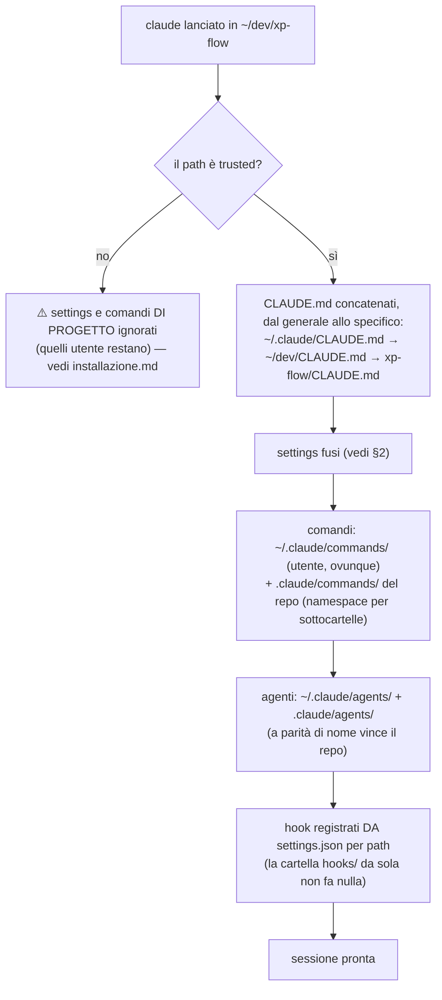
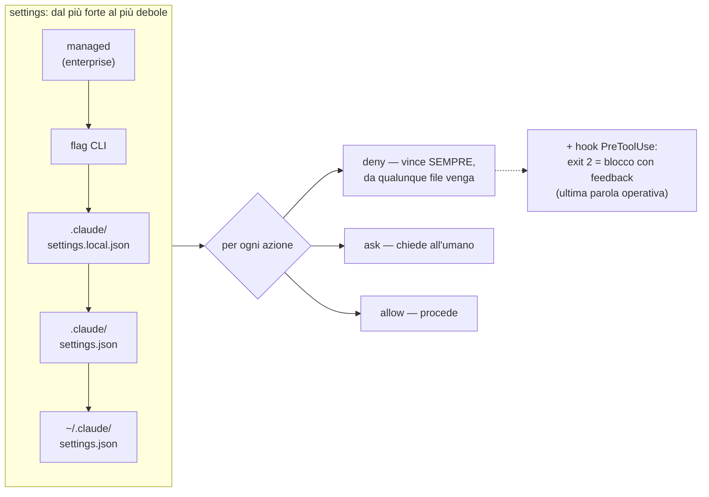
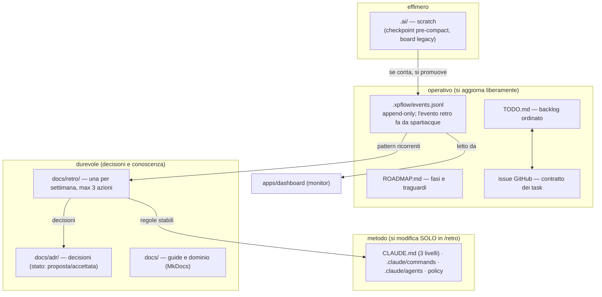

# Guida: quali file governano una sessione, in che ordine, con che priorità

> La domanda a cui risponde: "quando apro `claude` in xp-flow, cosa viene
> caricato, da dove, e chi vince quando due regole si contraddicono?"
> Le fonti restano dove sono ([comandi](comandi.md), [metodo](metodo-sviluppo-agentico.md),
> [installazione](installazione.md), README): qui c'è solo la meccanica.

## 1. Cosa carica Claude Code all'avvio

Punti che sorprendono sempre:
- I **CLAUDE.md si sommano**, non si sovrascrivono: il repo *specializza* il
  workspace che specializza l'utente. Per questo vanno tenuti corti — viaggiano
  in ogni chiamata.
- Il **trust è legato al path assoluto**: dopo un clone o uno spostamento va
  ridato, altrimenti i comandi del flusso "spariscono" in silenzio.
- I comandi di repo esistono **solo nelle sessioni lanciate dentro il repo**:
  da `~/dev` non vedi `/sprint` di xp-flow.

## 2. Priorità delle regole (chi vince)

Regole pratiche del laboratorio:
- **`deny` batte `allow` sempre** — è il fail-closed su cui poggiano i gate
  (secrets, `--force`, `reset --hard`).
- Push: gli agenti hanno allow SOLO su `git push origin feat/*` (ADR 0007);
  `main` è raggiungibile unicamente via PR con required checks.
- Gli hook si sommano da tutti i livelli; un hook che esce con codice 2
  blocca l'azione e rimanda il motivo all'agente.

## 3. Dove vive lo stato del metodo (e come si promuove)

La freccia importante è la **promozione**: niente nasce direttamente come
regola. Un attrito diventa evento (`metodo_feedback`), gli eventi diventano
analisi in retro, la retro produce al massimo 3 azioni e le regole stabili
salgono nei CLAUDE.md. In discesa vale il contrario: se un doc sparisse senza
che nessuno debba rifare una ricerca, era da archiviare (regola una-fonte).

## 4. Chi può toccare cosa

| Cosa | Chi/quando |
|---|---|
| TODO, ROADMAP, events.jsonl, issue | agenti e umano, liberamente (sempre sincronizzati) |
| docs/, ADR (contenuto nuovo) | liberamente; lo **stato** di una ADR cambia solo per decisione |
| CLAUDE.md, comandi, agenti, policy | **solo in `/retro`** (regola permanente dalla retro #2, 14/08/2026) |
| push | agenti solo `feat/*`; `main` solo via PR; tag/release e secret restano umani |
| `.ai/` | gli hook; contenuto sacrificabile per definizione |

Per il "cosa faccio adesso": [comandi.md](comandi.md) (cheat-sheet e giornata
tipo). Per il "perché è fatto così": [metodo](metodo-sviluppo-agentico.md) e
le ADR. Per il "da zero su una macchina nuova": [installazione](installazione.md).
